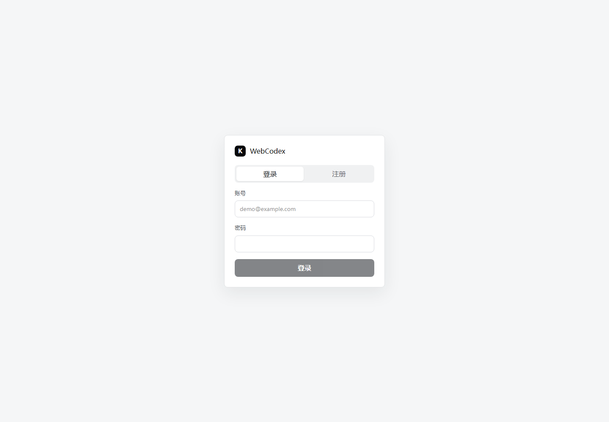

# WebCodex 流式输出恢复机制分析

本文分析 WebCodex 如何在模型流式输出过程中支持用户切出页面、关闭网页后再回到对话，并继续衔接已有流式输出。

## 页面截图



截图说明：当前截图来自项目已有的 `frontend/dist` 前端构建页面。本文的机制分析基于实际源码路径，重点覆盖后端事件持久化、SSE 游标续接、前端历史事件重放和 worker 生命周期。

## 核心结论

WebCodex 的续接能力不是依赖浏览器连接一直存在，而是依赖“事件先落库，再由浏览器按游标读取”的设计。

浏览器只是流式事件的消费者。真正的 run 在后端调度器和 Python worker 中执行。worker 把 OpenAI Agents SDK 的流式事件转换成 WebCodex run event，然后 POST 回 FastAPI。FastAPI 给每条事件分配递增 `seq` 并写入 SQLite 的 `run_events` 表。前端重新进入对话后，先读取历史事件重建 UI，再用 `after=lastSeq` 打开新的 SSE 连接继续接收后续事件。

整体模式可以理解为：

```text
Worker streaming event
  -> FastAPI /internal/runs/{run_id}/events
  -> SQLite run_events(run_id, seq, type, payload)
  -> Browser GET history
  -> Browser replay history into UI
  -> Browser EventSource /events?after=lastSeq
```

## 关键数据模型

续接能力主要依赖几张表：

- `runs`：保存一次运行的生命周期状态，例如 `queued`、`starting`、`running`、`completed`、`failed`、`cancelled`。
- `run_events`：保存 run 过程中的事件流，每条事件都有 run 内递增的 `seq`。
- `messages`：保存最终对话消息。用户消息在创建 run 时写入，assistant 消息在 `assistant.message.done` 时写入。
- `conversations`：对话容器，前端重新进入对话时会通过它找到当前未结束的 active run。

表结构定义在 `backend/app/db.py`，其中 `run_events` 的主键是 `(run_id, seq)`，这就是后续重放和游标续接的基础。

## 创建 Run 的过程

前端发送消息时，`frontend/src/main.jsx` 的 `submitMessage()` 会先在 UI 中乐观插入：

- 一条 user message。
- 一个 streaming 状态的 assistant 占位消息。

之后前端调用：

```text
POST /api/conversations/{conversation_id}/runs
```

后端在 `backend/app/main.py` 的 `create_run()` 中完成几件事：

1. 校验 conversation、workspace、attachment。
2. 创建新的 `run_id`。
3. 调用 `store.create_run()` 写入 `runs`。
4. 把用户消息写入 `messages`。
5. 写入第一条 `run.queued` event。
6. 返回 `run_id` 和事件流 URL。

这一步之后，即使浏览器立刻关闭，后端已经有了 run 元数据和第一条事件，后续 worker 仍然可以被调度执行。

## Worker 与浏览器解耦

后端启动时会运行 `run_scheduler_loop()`。它不断查询 `queued` run，将其 claim 成 `starting`，然后启动 Python worker。

关键点是：worker 是后端启动的独立子进程，不依赖浏览器页面存在。

```text
Browser closes
  -> SSE request disconnects
  -> FastAPI event_stream returns
  -> worker process continues
  -> worker keeps POSTing events to FastAPI
  -> events keep being written to SQLite
```

worker 子进程管理在 `backend/app/main.py` 的 `run_worker_process()`、`register_worker_process()` 和 `terminate_worker_process()`。只有用户调用 cancel 时，后端才会主动 terminate worker。普通页面关闭不会触发 cancel。

## SDK 流式事件如何变成可重放事件

Python worker 在 `worker-py/webcodex_worker/sandbox_runner.py` 中调用：

```python
result = Runner.run_streamed(...)
async for sdk_event in result.stream_events():
    for normalized_event in adapter.normalize(sdk_event):
        await client.post_event(settings.run_id, normalized_event)
```

`SdkEventAdapter` 在 `worker-py/webcodex_worker/sdk_events.py` 中负责事件转换。比如 OpenAI Responses 里的文本 delta：

```text
response.output_text.delta
```

会被转换成 WebCodex 的：

```text
assistant.message.delta
```

并携带：

```json
{
  "text": "...",
  "source": "openai-agents-python"
}
```

这些事件不是直接推给浏览器，而是先 POST 到后端内部接口：

```text
POST /internal/runs/{run_id}/events
```

## 后端如何落库

后端内部接口在 `backend/app/main.py` 的 `append_worker_event()`。

它会调用 `store.append_event()`，由 `backend/app/db.py` 分配下一个 `seq`：

```text
SELECT COALESCE(MAX(seq), 0) + 1 AS next_seq
FROM run_events
WHERE run_id = ?
```

然后写入 `run_events`。

因此每个 run 的事件天然形成一条可重放日志：

```text
seq=1  run.queued
seq=2  run.started
seq=3  assistant.message.created
seq=4  assistant.message.delta
seq=5  assistant.message.delta
...
seq=N  run.completed
```

同时，`append_worker_event()` 还会维护 run 状态：

- `run.started` -> `runs.status = running`
- `run.completed` -> `runs.status = completed`
- `run.failed` -> `runs.status = failed`
- `run.cancelled` -> `runs.status = cancelled`

当收到 `assistant.message.done` 时，后端还会把完整 assistant 文本写入 `messages`。这保证了完成后的历史对话能直接从 messages 读取，也能从 run events 还原更丰富的工具、推理和增量过程。

## SSE 如何支持断线续接

前端连接 SSE 的接口是：

```text
GET /api/runs/{run_id}/events?after=N
```

后端实现位于 `backend/app/main.py` 的 `event_stream()`：

```text
cursor = after
while True:
  events = store.list_events(run_id, after=cursor, limit=100)
  for event in events:
    cursor = event.seq
    yield sse(event)
    if event.type in terminal events:
      return

  if request disconnected:
    return

  yield heartbeat
  sleep 0.5s
```

这里的 `after` 是关键。后端只返回：

```text
seq > after
```

所以前端只要保存自己已经处理到的最后一个 `seq`，就可以安全地重新连接。

## 前端如何处理实时事件

前端的 `connectEvents(runId)` 会创建：

```js
new EventSource(`/api/runs/${runId}/events?after=${eventSeqRef.current}`)
```

每收到一个事件，`handleRunEvent()` 都会先更新：

```js
eventSeqRef.current = max(eventSeqRef.current, event.seq)
```

然后根据 event type 更新 UI：

- `assistant.message.delta`：追加文本块。
- `assistant.message.done`：完成文本块。
- `assistant.reasoning_summary.delta`：追加推理摘要块。
- `tool.call.*`：更新工具调用块。
- `run.completed`：停止 streaming，关闭 SSE。
- `run.failed`：显示错误，停止 streaming。
- `run.cancelled`：标记取消，停止 streaming。

这意味着前端的 UI 状态是由事件日志驱动出来的。

## 关闭网页后重新进入如何恢复

用户重新进入某个对话时，前端会执行 `selectConversation(conversationId)`。

它先调用：

```text
GET /api/conversations/{conversation_id}/messages
```

后端返回：

```json
{
  "messages": [],
  "activeRun": {}
}
```

其中 `activeRun` 来自 `get_active_run_for_conversation()`，查询条件是：

```text
status NOT IN ('completed', 'failed', 'cancelled')
```

也就是说，只要这个 conversation 还有未结束的 run，前端就能找到它。

如果存在 active run，前端会：

1. 创建一个新的 streaming assistant 占位。
2. 调用 `replayRunEvents(activeRun.id, assistantId)`。
3. 从 `/api/runs/{run_id}/events/history?limit=5000` 拉取历史事件。
4. 按顺序调用 `handleRunEvent()` 重建 UI。
5. 把 `eventSeqRef.current` 设置为历史事件中的 `lastSeq`。
6. 调用 `connectEvents(activeRun.id)`，使用 `after=lastSeq` 继续 SSE。

这个流程解决了两个问题：

- 页面关闭期间已经产生的 delta 不会丢，因为它们都在 `run_events`。
- 重连瞬间不会重复显示旧 delta，因为 SSE 使用 `after=lastSeq`。

## 为什么不会丢中间事件

假设用户在 `seq=20` 时关闭网页。worker 继续执行并写入：

```text
seq=21  assistant.message.delta
seq=22  assistant.message.delta
seq=23  tool.call.started
seq=24  tool.call.completed
```

用户重新打开对话时：

1. history 接口返回 `seq=1..24`。
2. 前端重放所有事件，UI 恢复到 `seq=24` 的状态。
3. `eventSeqRef.current = 24`。
4. 新 SSE 请求 `/events?after=24`。
5. 后端只推送 `seq > 24` 的事件。

因此“关闭网页期间产生的事件”和“重新连接之后产生的事件”可以无缝拼接。

## 与普通 SSE 的差异

普通 SSE 如果只把模型输出直接写到 HTTP response，浏览器断线后中间输出就丢了。WebCodex 的做法不同：

```text
普通方案：
model stream -> HTTP response -> browser

WebCodex：
model stream -> run_events table -> history API / SSE API -> browser
```

WebCodex 的核心不是“不断线”，而是“断线后可重放”。

## 当前实现的边界条件

当前代码已经具备主要续接能力，但还有几个边界需要注意。

第一，前端没有把最后打开的 `conversationId` 持久化到 URL 或 localStorage。重新打开网页后，用户需要手动点进对应历史对话，才会触发 active run 恢复。

第二，`source.onerror` 当前会把 UI 标成连接中断并关闭 SSE，没有自动退避重连。虽然重新进入对话可以恢复，但短暂网络抖动时体验还可以继续增强。

第三，历史事件接口当前使用 `limit=5000`。极长 run 如果超过 5000 条事件，前端完整重建可能不够，需要分页拉取或按 `after` 分批读取。

第四，后端 startup 只会把 `starting` 状态的 run 重新排队。如果后端进程在 worker 正在 `running` 时崩溃，当前代码没有完整恢复 running worker 的能力，可能出现 run 卡在 running 的情况。

第五，同一个 conversation 如果多个 tab 并发创建多个未结束 run，`activeRun` 只会选最新的非终态 run，旧 run 的 UI 续接可能不符合用户预期。

## 建议增强点

建议优先做四个增强：

1. 把当前 `conversationId` 写入 URL 或 localStorage，刷新和重新打开后自动回到最后一个对话。
2. `EventSource.onerror` 中加入自动重连，继续使用当前 `eventSeqRef.current` 作为 `after`。
3. 历史事件改成分页重放，避免 `limit=5000` 截断长 run。
4. 后端启动时扫描长时间 `running` 的 run，结合 worker 进程状态做恢复、重试或标记失败。

## 最简架构总结

WebCodex 的流式恢复机制本质上是事件日志：

```text
run_events 是事实来源
messages 是最终对话结果
SSE 是实时读取通道
history API 是恢复读取通道
event seq 是去重和续接游标
worker 生命周期独立于浏览器页面
```

只要 worker 仍在运行、事件能持续写入 SQLite，用户关闭页面再回来后就可以通过“历史重放 + after 游标 SSE”继续衔接流式输出。
